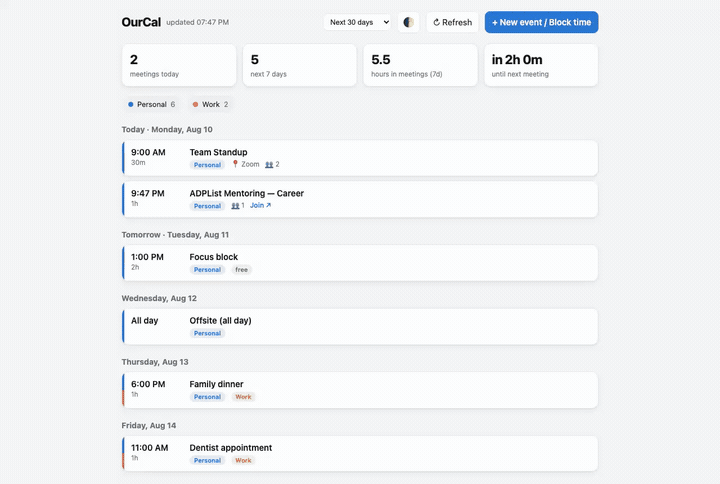
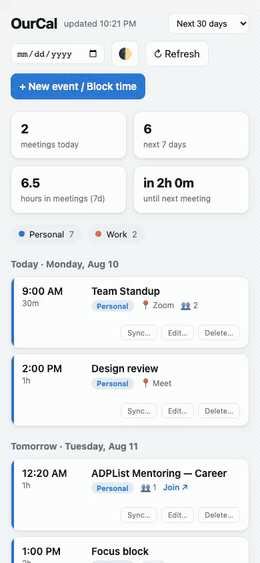

# OurCal

**A unified calendar dashboard for every Google account you own.**


OurCal brings **all calendars from all of your Google accounts** into a single
view, and lets you create, edit, sync and delete events across any selection of
them. It scales from one person's handful of accounts to a whole household —
adding someone is one config entry plus one sign-in.

The app and its interface are pure Python 3.9+ standard library, served as a web
page on `127.0.0.1:8756`. The only external dependencies are Google's two client
libraries, which OurCal installs for you on first run.

---

## Contents

- [Demo](#demo)
- [Try it instantly](#try-it-instantly)
- [Install](#install)
- [Connect your accounts](#connect-your-accounts)
- [Features](#features)
- [Configuration](#configuration)
- [Development](#development)
- [Privacy](#privacy)
- [Contributing](#contributing)
- [License](#license)

## Demo

Both clips are recorded in demo mode against built-in fixtures — every
account, address and event in them is made up. They are scripted rather than
screen-captured (`packaging/record-demo.py`), so re-recording after a UI
change cannot accidentally put a real calendar on the internet.

**On a Mac** — the unified agenda, widening the range to three months,
creating an event across accounts, then syncing, editing and deleting a row
at its source:



*[Full quality (MP4)](docs/demo/ourcal-desktop.mp4)*

**At phone width** — the same interface narrow, where each row's actions move
to their own line, and the **Set up this device** page that adds an account or
imports a bundle:



*[Full quality (MP4)](docs/demo/ourcal-phone.mp4)*

> This second clip is the interface at a phone's width, not a recording of
> the Android app. Installing the APK, getting past Play Protect and signing
> in to Google on the device are covered in [Install](#as-an-android-app) and
> the [setup guide](SETUP_GUIDE.md#on-android-sign-in-on-the-device).

## Try it instantly

No Google account, no setup, nothing to configure:

```bash
OURCAL_DEMO=1 python3 ourcal.py
```

This opens your browser to the dashboard automatically. If it doesn't, use
the URL printed in the terminal — a bare `http://127.0.0.1:8756` (no `?k=`
key) now returns 403 by design. Demo mode serves realistic fixtures and
every flow is clickable — create, edit, sync and delete all work against an
in-memory store, so it is the safe place to try deleting something.

## Install

### As a Mac app

Download the `.dmg` from [Releases](../../releases), drag **OurCal** to
Applications, then **right-click it → Open → Open** the first time.

That step matters. macOS will otherwise refuse with *"OurCal is damaged and
can't be opened"*. It is not damaged — the app is unsigned, and that is simply
how macOS words an unsigned download. Right-click → Open is the supported way
past it, once per install. The terminal equivalent:

```bash
xattr -dr com.apple.quarantine /Applications/OurCal.app
```

The app runs its own server internally and shows the dashboard in a real window
— no terminal, no browser tab. Your credentials and sign-ins live in
`~/Library/Application Support/OurCal/`, outside the app, so upgrading never
signs you out.

Apple Silicon only. To build it yourself: `./packaging/build-app.sh`.

### As an Android app

Download the `.apk` from [Releases](../../releases) and open it on your
phone to install it. There's no Play Store listing — it's a sideload, so
Play Protect will say **"App blocked to protect your device"**; tap
**Install anyway**. That's because the app isn't from the Store, not
because anything is wrong with it.

The `.apk` on the **latest** release bundles its own OAuth client, so you can
add an account and sign in right on the phone — no computer, no Google Cloud
project needed. Full walkthrough, including the "Google hasn't verified this
app" screen you'll also hit: [On Android: sign in on the
device](SETUP_GUIDE.md#on-android-sign-in-on-the-device). (A pre-release —
anything not labelled **Latest** — is a manual test build and may not have
one; see [Development](#development).)

To build it yourself instead: `./packaging/build-android.sh`.

### From source

```bash
git clone <your-fork-url> && cd OurCal
python3 ourcal.py            # add --window for a native window
```

First run creates a private `.ourcal-venv/` and installs the two Google
libraries into it.

## Connect your accounts

**The `.dmg` removes the Python setup, not the Google setup.** OurCal reads your
calendars with *your own* OAuth credentials, so there is a one-time Google Cloud
step: create a project, enable the Calendar API, configure a consent screen, and
download a Desktop OAuth client as `credentials.json`.

Full walkthrough: **[SETUP_GUIDE.md](SETUP_GUIDE.md)**.

Android is the exception: the `.apk` on the **latest** release already has
an OAuth client bundled in, and so does a self-built one —
`packaging/build-android.sh` ships one inside the APK when it finds
`credentials.json` in the working tree — so that install can add an account
and sign in with no computer at all once it's on the phone — see [On Android:
sign in on the
device](SETUP_GUIDE.md#on-android-sign-in-on-the-device). That doesn't change
what you do here. `credentials.json` is an app identity, not an account key —
it holds a client id and secret and no refresh token, and Google issues a
token only once a person signs in and consents, so an extracted secret
reaches nobody's Google account. What it does permit is impersonation (a fake
app showing "OurCal" on a genuine consent screen), the project's request
quota, and revocation if either is abused, which breaks sign-in for everyone
until a new client is issued and users re-authorise. A pasted
`credentials.json` still takes precedence over the bundled one, so bringing
your own Google Cloud project is unaffected. Running from source never
bundles a client, so the steps above are unchanged there.

Put `credentials.json` and `accounts.json` in `~/Library/Application
Support/OurCal/` for the packaged app, or next to `ourcal.py` when running from
source.

### On Android

Two ways to get going on the phone.

**Using the bundled client** — the default whether you downloaded the `.apk`
from the **latest** release or built it yourself with `credentials.json`
present (`packaging/build-android.sh` bundles the client in either way) —
add an account and sign in right on the phone, no computer needed. Full
walkthrough: [On Android: sign in on the
device](SETUP_GUIDE.md#on-android-sign-in-on-the-device).

**To bring across a setup you already have on a Mac** — your own Google Cloud
project, or accounts you'd rather not sign in to twice — move it across
instead. The Google Cloud step itself still needs a computer; a phone cannot
realistically create a project and download a client:

```bash
./ourcal.py --export | pbcopy      # choose a passphrase when asked
```

Send yourself the bundle, open OurCal on the phone, tap **Set up this device**,
paste it in, and enter the same passphrase. Your accounts appear without a
restart.

The bundle is encrypted, but it carries live Google refresh tokens. Use a
passphrase you would use for a password, and delete the message afterwards.

Android 11+ hides `Android/data` from every file manager and from MTP, so
copying the files onto the phone directly is not possible — pasting the
bundle in is how this route works around that.

## Features

- **Unified agenda** across every selected calendar of every
  configured account (including calendars synced into them, e.g. ADPList),
  auto-refreshing every 5 minutes with a **Refresh** button for an instant poll.
- **One row per appointment.** The same appointment sitting on four accounts is
  four Google events with four different IDs — OurCal collapses them into a
  single row wearing every calendar's badge, with a striped accent bar, instead
  of repeating it once per account. Deleting still reaches all four copies.
- **Choose how far ahead you look** — 30 days by default, up to a year from the
  header. Events further out than the current window simply are not fetched, so
  a wider range costs proportionally more Google calls.
- **Stat tiles** (meetings today / next 7 days / hours in meetings / countdown),
  **per-account filter chips**, live-meeting highlighting, Join links, and a
  light/dark theme (follows your system, with a manual toggle).
- **New event / Block time** form that creates an event once and pushes it to any
  selection of accounts, each marked **Blocking** (busy) or **Non-blocking**
  (free), in one of two modes:
  - **Copies** — an independent event written to each selected account's calendar.
  - **Invite** — one host account creates a single shared event and invites the
    others (real Google invite with RSVP).
- **Sync an existing event** to your other calendars — hover any row and pick
  **Sync…**. Title and time are prefilled and editable; the original is never
  modified. Each copy lands as either **full details** or a **busy block** that
  holds the time while hiding the title, location, and notes.
- **Edit an event at its source** — hover any row and pick **Edit…**. Change the
  title, date, time, location, or notes and the change is written back to the
  real Google events behind the row. A row that lives on four calendars lists
  all four with checkboxes, so one reschedule moves every copy; untick one to
  leave it where it is. Only the fields you actually touch are sent, so an edit
  never overwrites something on another copy that you did not change. Recurring
  events offer this-occurrence or whole-series, and guests are never emailed.
  Events you were invited to but do not organize show Edit disabled — Google
  only lets the organizer change those.
- **Forward an invite outside** — enter any address in the sync form and choose
  which of your accounts sends it. That copy always carries full details so the
  invite is readable, while your own mirrors stay as private as you chose.
- **Delete at the source** — hover any row and pick **Delete…**. Events merged
  across several accounts list every calendar they live in, all pre-checked, so
  you see the blast radius and can narrow it. Recurring events ask whether to
  remove one occurrence or the whole series. Deletions land in Google's trash
  and are restorable for about 30 days.

## Configuration

**Your accounts** go in `accounts.json`. It is git-ignored, so your addresses
never enter the repository:

```json
[
  {"label": "Personal", "email": "you@example.com"},
  {"label": "Work",     "email": "you@work.example.com"}
]
```

The `label` names the badge and that account's token file; the `email` is
verified against whoever actually signs in, so a token cannot end up filed under
the wrong account. Without this file, OurCal falls back to placeholders.

**Everything else** is at the top of `ourcal.py`:

```python
TIMEZONE = "America/Los_Angeles"
DAYS_AHEAD = 30
POLL_MINUTES = 5
PORT = 8756
VERSION = "1.0.1"
```

## Development

```bash
python3 -m unittest discover tests -v
```

No Google credentials or network needed — the full suite runs in demo mode
against in-memory fixtures.

| Task | Command |
|---|---|
| Run the app | `python3 ourcal.py` |
| Run with a native window | `python3 ourcal.py --window` |
| Run the demo | `OURCAL_DEMO=1 python3 ourcal.py` |
| Run the tests | `python3 -m unittest discover tests -q` |
| Build the Mac app + `.dmg` | `./packaging/build-app.sh` |
| Build the Android `.apk` | `./packaging/build-android.sh` |
| Re-record the README demos | `python3 packaging/record-demo.py` |

The whole application is one file, `ourcal.py`, with the interface embedded as
an HTML/CSS/JS string. That is deliberate — see [Contributing](#contributing).

**Releases** are cut by bumping `VERSION` in `ourcal.py`, then pushing a
matching tag (`git tag v1.0.1 && git push origin v1.0.1`) or running the release
workflow manually. The workflow refuses to build when the tag and `VERSION`
disagree.

`.github/workflows/release.yml` builds and publishes both the `.dmg` and the
`.apk` — see [Install](#install) for the download-and-sideload steps most
people want. A **tagged** release is gated: the workflow refuses to publish
unless the APK is release-signed with the project's own keystore and carries
a bundled OAuth client, so anyone downloading the **latest** release gets a
build meant to be handed around, not one signed with the Android SDK's
shared debug key. A manual `workflow_dispatch` run (no tag) skips that gate,
so its APK may come back debug-signed or paste-only; the workflow publishes
it as a **pre-release** rather than Latest, so it can't present itself as
the release to grab — useful for exercising the pipeline, not for
distributing. Building from source with
`./packaging/build-android.sh` still produces a debug-signed APK unless you
also set the `ANDROID_KEYSTORE_*` variables it reads for release signing;
either way you sideload the result yourself, and Play Protect will warn on
install ("App blocked to protect your device" — tap **Install anyway**).
[NOTES-android.md](NOTES-android.md) covers the earlier OAuth-on-Android
spike, Play Protect, build cost and the shape of the migration.

### Setting up Android release signing

Release signing and the bundled OAuth client are both optional — without them
the release workflow still builds and publishes a debug-signed, paste-only
APK on a `workflow_dispatch` run (a **tagged** release refuses to publish at
all until they're set; see above). A maintainer who wants the real signed
build creates five repository secrets once, under **Settings → Secrets and
variables → Actions**:

| Secret | Contents |
|---|---|
| `ANDROID_KEYSTORE_B64` | `base64 -i ourcal.jks` |
| `ANDROID_KEYSTORE_PASSWORD` | the store password |
| `ANDROID_KEY_ALIAS` | the key alias |
| `ANDROID_KEY_PASSWORD` | the key password |
| `ANDROID_OAUTH_CLIENT` | the contents of a Desktop OAuth `credentials.json` |

Generate the keystore once, **outside the repository** — `*.jks` is
git-ignored as a backstop, but a file that was never in the tree cannot be
committed by accident:

```bash
mkdir -p ~/OurCal-signing
keytool -genkeypair -v -keystore ~/OurCal-signing/ourcal.jks -alias ourcal \
        -keyalg RSA -keysize 4096 -validity 10000
chmod 600 ~/OurCal-signing/ourcal.jks   # keytool leaves it world-readable
```

Verify it before going near CI — this catches a mistyped password locally
instead of costing a build to discover:

```bash
keytool -list -keystore ~/OurCal-signing/ourcal.jks -alias ourcal   # want: PrivateKeyEntry
```

**Set the secrets with `printf`, not a here-string or an interactive paste.**
`apksigner` reads `--ks-pass env:` verbatim, so one trailing newline makes a
correct password fail as `keystore password was incorrect` — a message that
sends you looking for a wrong password that isn't wrong. `gh secret set X <<<
"value"` and pasting at the interactive prompt both append one:

```bash
base64 -i ~/OurCal-signing/ourcal.jks | gh secret set ANDROID_KEYSTORE_B64
printf '%s' 'ourcal' | gh secret set ANDROID_KEY_ALIAS
gh secret set ANDROID_OAUTH_CLIENT < credentials.json
read -rs "PW?keystore password: "; echo         # zsh; bash: read -rsp "..."
printf '%s' "$PW" | gh secret set ANDROID_KEYSTORE_PASSWORD
printf '%s' "$PW" | gh secret set ANDROID_KEY_PASSWORD
unset PW
```

Secrets cannot be read back, so a bad value is only visible as a failed
build. Pasting into the web UI is also fine — the field does not add a
newline.

**Back up `ourcal.jks` somewhere durable and never commit it.** This is the
one unrecoverable mistake available in this project: losing it means no
future APK can ever install as an update over an existing one again — every
user who has a signed build installed would have to uninstall it, losing
their local setup (accounts and tokens), before they could take a new one.

## Privacy

Everything runs on your own machine. The interface is served only on
`127.0.0.1`, and your credentials, tokens and calendar data never leave your
computer. There is no OurCal server, no telemetry and no third party — calendar
data is fetched straight from Google to you and held in memory.

`accounts.json`, `credentials.json` and every `token_*.json` are git-ignored, so
publishing your copy never leaks an address or a token.

## Contributing

Contributions are welcome. See [CONTRIBUTING.md](CONTRIBUTING.md) for the
project's two hard constraints (single file, standard library only) and how to
run the tests.

## License

[MIT](LICENSE) — use it, fork it, ship it. No warranty.
